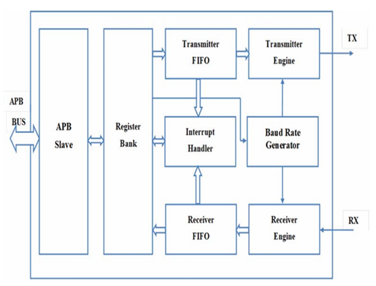
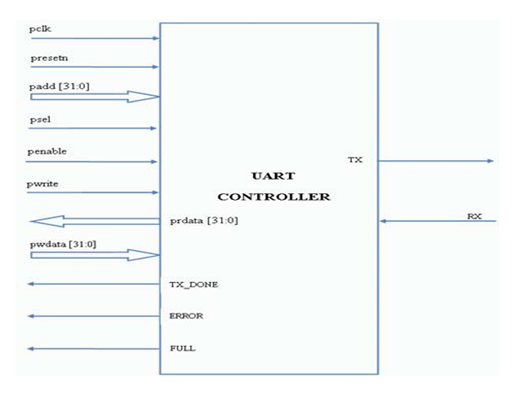

# UART APB Controller

## Mục lục
- [Giới thiệu](#giới-thiệu)
- [Kiến trúc tổng thể](#kiến-trúc-tổng-thể)
- [Chức năng các khối](#chức-năng-các-khối)
- [Sơ đồ chân kết nối (Pinout & Interface)](#sơ-đồ-chân-kết-nối-pinout--interface)
- [Hướng dẫn tích hợp & sử dụng](#hướng-dẫn-tích-hợp--sử-dụng)
- [Hướng dẫn mô phỏng & kiểm thử](#hướng-dẫn-mô-phỏng--kiểm-thử)
- [Kết quả mô phỏng thực tế (Vivado)](#kết-quả-mô-phỏng-thực-tế-vivado)
- [Tài liệu & liên hệ](#tài-liệu--liên-hệ)

---

## Giới thiệu

**UART APB Controller** là một module UART (Universal Asynchronous Receiver/Transmitter) được thiết kế để giao tiếp với bus APB (Advanced Peripheral Bus). Kiến trúc module gồm nhiều khối chức năng rõ ràng, dễ dàng tích hợp vào các hệ thống SoC, FPGA hoặc ASIC.

**Ứng dụng:**
- Truyền nhận dữ liệu nối tiếp tốc độ cao giữa vi điều khiển và các thiết bị ngoại vi.
- Tích hợp trong các hệ thống nhúng có chuẩn bus APB.
- Nghiên cứu, phát triển và kiểm thử giao tiếp UART chuẩn công nghiệp.

---

## Kiến trúc tổng thể



**Mô tả sơ đồ khối:**
- **APB Slave:** Giao tiếp với bus APB, nhận lệnh đọc/ghi từ CPU/MCU.
- **Register Bank:** Tập các thanh ghi cấu hình, trạng thái và dữ liệu.
- **Transmitter FIFO:** Bộ đệm truyền, đảm bảo dữ liệu được truyền liên tục.
- **Transmitter Engine:** Bộ máy truyền dữ liệu theo chuẩn UART.
- **Receiver FIFO:** Bộ đệm nhận, lưu trữ dữ liệu nhận được.
- **Receiver Engine:** Bộ máy nhận dữ liệu UART.
- **Baud Rate Generator:** Sinh xung nhịp truyền/nhận dữ liệu theo tốc độ mong muốn.
- **Interrupt Handler:** Quản lý ngắt truyền/nhận, báo trạng thái cho CPU.

---

## Chức năng các khối

| Khối                  | Chức năng chính                                                                                  |
|-----------------------|-------------------------------------------------------------------------------------------------|
| **APB Slave**         | Nhận/giải mã tín hiệu từ bus APB, điều khiển truy cập thanh ghi nội bộ                          |
| **Register Bank**     | Lưu trữ thanh ghi điều khiển, trạng thái, dữ liệu truyền/nhận                                   |
| **Transmitter FIFO**  | Đệm dữ liệu cần truyền, tránh mất dữ liệu do tốc độ truyền/nhận không đồng bộ                   |
| **Transmitter Engine**| Điều khiển truyền dữ liệu nối tiếp theo chuẩn UART                                              |
| **Receiver FIFO**     | Lưu trữ dữ liệu nhận được trước khi CPU xử lý                                                  |
| **Receiver Engine**   | Nhận và giải mã dữ liệu từ chuẩn UART                                                           |
| **Baud Rate Generator** | Tạo xung nhịp cho truyền/nhận theo tốc độ cấu hình                                            |
| **Interrupt Handler** | Sinh tín hiệu ngắt khi truyền xong, nhận xong, hoặc có lỗi                                      |

---

## Sơ đồ chân kết nối (Pinout & Interface)



**Mô tả tín hiệu:**

| Tên tín hiệu      | Kiểu    | Vai trò                                       |
|-------------------|---------|-----------------------------------------------|
| `pclk`            | input   | Clock cho APB                                 |
| `presetn`         | input   | Reset bất đồng bộ (active low)                |
| `paddr[31:0]`     | input   | Địa chỉ thanh ghi APB                         |
| `psel`            | input   | Chọn module APB                               |
| `penable`         | input   | Kích hoạt giao dịch APB                       |
| `pwrite`          | input   | Chọn chế độ ghi (1) hoặc đọc (0)              |
| `pwdata[31:0]`    | input   | Dữ liệu ghi lên thanh ghi                     |
| `prdata[31:0]`    | output  | Dữ liệu đọc từ thanh ghi                      |
| `TX`              | output  | Dữ liệu UART truyền ra                        |
| `RX`              | input   | Dữ liệu UART nhận vào                         |
| `TX_DONE`         | output  | Báo hiệu truyền UART đã hoàn thành            |
| `ERROR`           | output  | Báo hiệu lỗi truyền/nhận UART                 |
| `FULL`            | output  | Báo hiệu FIFO đầy                             |

---

## Hướng dẫn tích hợp & sử dụng

1. **Kết nối module vào hệ thống APB của bạn:**  
   - Đảm bảo cấp clock (`pclk`), reset (`presetn`) đúng chuẩn bus APB.
   - Kết nối tín hiệu UART (`TX`, `RX`) ra ngoài.

2. **Cấu hình tốc độ baud:**  
   - Ghi giá trị mong muốn vào thanh ghi baud rate thông qua bus APB.

3. **Truyền dữ liệu:**
   - Ghi dữ liệu vào FIFO truyền qua bus APB.
   - Theo dõi tín hiệu `FULL` để tránh ghi tràn FIFO.

4. **Nhận dữ liệu:**
   - Đọc dữ liệu từ FIFO nhận khi có dữ liệu hoặc interrupt báo có dữ liệu mới.

5. **Xử lý ngắt và lỗi:**
   - Sử dụng tín hiệu `TX_DONE`, `ERROR` để xử lý các tình huống phát sinh.

---

## Hướng dẫn mô phỏng & kiểm thử

1. **Chuẩn bị phần mềm mô phỏng:**  
   - Có thể dùng ModelSim, Icarus Verilog, hoặc Vivado Simulator.

2. **Chạy testbench:**
   - Các testbench mẫu nằm trong thư mục `tb/`.
   - Command mẫu với Icarus Verilog:
     ```sh
     iverilog -o uart_testbench tb/test.v src/*.v
     vvp uart_testbench
     ```
   - Với Vivado, tạo project, thêm toàn bộ file trong `src/` và testbench, chạy simulation.

3. **Phân tích kết quả:**
   - Kết quả truyền/nhận dữ liệu và trạng thái module sẽ in ra console hoặc file `.vcd` để xem bằng GTKWave hoặc Vivado Integrated Logic Analyzer (ILA).

---

## Kết quả mô phỏng thực tế (Vivado)

Dưới đây là ảnh chụp sóng mô phỏng kết quả thực tế khi chạy testbench với Vivado:


**Giải thích các tín hiệu nổi bật:**
- Các tín hiệu điều khiển APB (`psel_tb`, `penable_tb`, `pwrite_tb`, `paddr`, ...) hoạt động đúng trình tự giao tiếp.
- Dữ liệu được ghi vào và đọc ra từ thanh ghi qua bus APB (`pwdata`, `prdata`).
- Các tín hiệu trạng thái như `TX_DONE_tb`, `ERROR_tb`, `FULL_tb` phản ánh đúng trạng thái truyền nhận.
- Sóng dữ liệu truyền UART (`TX_tb`) thay đổi tương ứng với dữ liệu cần truyền ra.

---

## Tài liệu & liên hệ

- Tài liệu chi tiết: Xem thêm trong thư mục `doc/` (nếu có).
- Nếu có thắc mắc, góp ý hoặc phát hiện lỗi, hãy tạo [issue](https://github.com/hoang4nhpham/uart-apb-controller/issues) hoặc liên hệ trực tiếp.

---

**Tác giả:**  
- Hoàng Anh Phạm  
- Email: hoanganhphamcong@gmail.com

---

> _README này sử dụng hình minh họa kiến trúc, sơ đồ chân và kết quả mô phỏng thực tế do bạn cung cấp._
